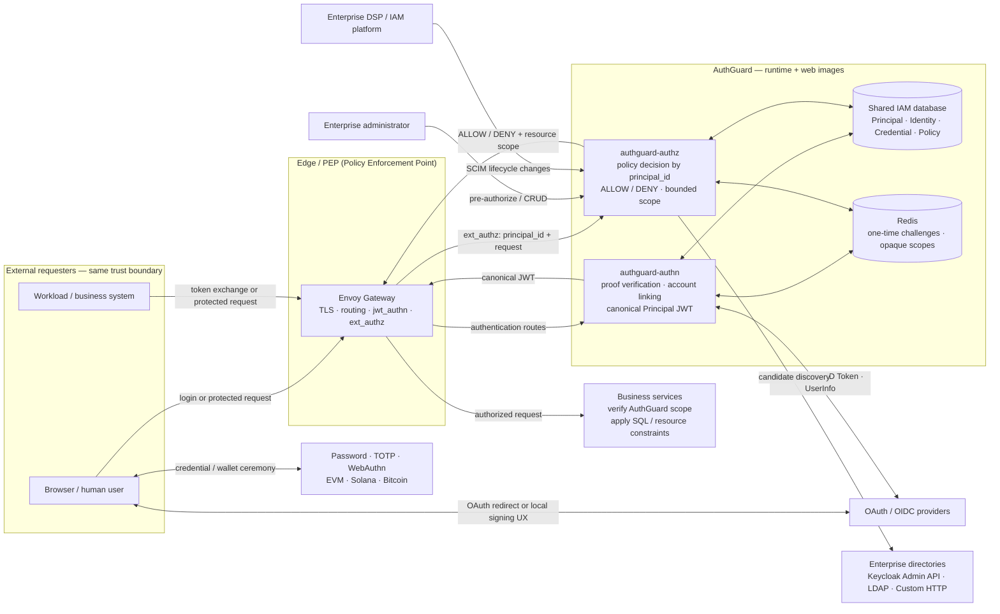

# AuthGuard

[](https://github.com/wl4g/authguard/actions/workflows/ci.yml)
[](https://www.rust-lang.org/)
[](./LICENSE)
[](https://www.rfc-editor.org/rfc/rfc6749)
[](https://openid.net/specs/openid-connect-core-1_0.html)
[](https://www.w3.org/TR/webauthn-3/)
[](https://standards.chainagnostic.org/CAIPs/caip-122)
[](https://helm.sh/)

*A universal IAM authentication and resource-level authorization platform for
microservices, written in Rust. It supports OAuth 2.0-like protocols, OpenID
Connect (OIDC), password authentication with TOTP (RFC 6238;
Google Authenticator-compatible), WebAuthn/FIDO2 (CTAP and passkeys), and wallet
authentication (CAIP-122/SIWX, ERC-4361/SIWE, and more).*

All supported authentication methods converge into one protocol-independent
Principal and one AuthGuard JWT. Envoy Gateway remains the request-path PEP;
AuthGuard AuthZ is the PDP and never becomes a reverse proxy.

## Features

- **Unified authentication result** — OAuth/OIDC, Password/TOTP, WebAuthn, and
  CAIP/SIWX providers all produce the same transient `AuthenticationResult`
  before account linking and token issuance.
- **Standalone credentials** — Argon2id password hashes, RFC 6238 TOTP with
  encrypted secrets and replay counters, plus WebAuthn credentials for passkeys,
  platform authenticators, and security keys.
- **Chain-agnostic wallet authentication** — CAIP-2 chain IDs, CAIP-10 account
  IDs, and CAIP-122/SIWX challenges for EVM, Solana, and Bitcoin. EOA, Solana,
  and BIP-322 proofs verify offline; ERC-1271/6492 contract proofs use only
  server-configured trusted RPC endpoints.
- **Protocol-independent identity** — account linking uses
  `(provider, issuer, subject)` and never merges by email, display name, ENS,
  wallet metadata, or other profile attributes.
- **One Principal and one token pipeline** — every successful login resolves a
  canonical `principal_id`; JWTs consistently carry `sub`, `amr`, `acr`,
  `auth_time`, `iat`, and `exp`.
- **Hosted Login, not an SDK** — a single AuthGuard Web image serves
  `/auth/login`, authenticated `/auth/account/security`, and `/auth/assets/*`
  on each relying application's own host. `authn.applications` resolves trusted
  host branding, static Theme Packs, and allow-listed `return_to` paths; no
  iframe, copied UI, executable theme plugin, or browser token storage is needed.
- **Envoy-native authorization** — Envoy Gateway performs `jwt_authn` and
  `ext_authz`; AuthGuard evaluates `principal_id + resource + action + context`
  and returns bounded resource scope.
- **Enterprise identity lifecycle** — Keycloak, LDAP, custom HTTP discovery, and
  SCIM provisioning support administrator pre-authorization without becoming
  runtime dependencies.
- **Dashboard and API CLI** — a multilingual React Dashboard and the
  `authguard api` client manage Principals and revisioned authorization policy.
- **Production operations** — PostgreSQL/SQLite IAM storage, Redis-backed
  one-time challenges and authorization scope, Prometheus metrics, structured
  logs, OpenTelemetry traces, Docker images, and an OCI Helm chart.
- **Real end-to-end verification** — disposable Keycloak, LDAP, PostgreSQL,
  Redis, Envoy, Anvil, and Solana services; Chromium WebAuthn/CTAP2 and wallet
  journeys; multi-language SDK integration; evidence-producing API/UI cases.

## Architecture



Every protocol converges before identity governance:

```text
OAuth / OIDC ────────────────┐
Password / TOTP / WebAuthn ──┼──> AuthenticationResult
CAIP / SIWX Wallet ──────────┘              |
                                               v
                                      Account Linking
                                               |
                                               v
                                      Canonical Principal
                                               |
                                               v
                                      Unified AuthGuard JWT
                                               |
                                               v
                                      Envoy PEP -> AuthZ PDP
```

The core boundary is deliberate:

| Model | Responsibility | Must not contain |
|---|---|---|
| `AuthenticationResult` | How this request proved an identity: identity, `amr`, `acr`, and authentication time | Persistent authorization policy |
| `ExternalIdentity` | Stable external identity: provider, issuer, and subject | Passwords, OTPs, private keys, or authorization decisions |
| `Principal` | Protocol-independent internal identity referenced by `principal_id` | OAuth, wallet, CAIP, WebAuthn, or password semantics |
| Authorization input | `principal_id`, resource, action, and bounded context | Provider tokens, wallet signatures, email login, or credentials |

See the concise [authentication whitepaper](docs/architecture/iam-authentication-whitepaper.md)
([中文](docs/architecture/iam-authentication-whitepaper_ZH.md)) and
[authorization whitepaper](docs/architecture/iam-authorization-whitepaper.md)
([中文](docs/architecture/iam-authorization-whitepaper_ZH.md)) for the complete
trust and data-flow model.

## Quick Start

### Requirements

- Rust 1.88+; the optional `web3` feature currently requires Rust 1.91+
- Node.js 22+, Go 1.24+, JDK 21, and Python 3.12 for the complete test matrix
- Helm 3.17+ and a Docker-compatible builder for deployment artifacts

### Build and run

```bash
git clone https://github.com/wl4g/authguard.git
cd authguard

# Build the backend, React UI, and language modules.
make build

# Opt in to CAIP/SIWX wallet verification and Web3 dependencies.
cargo build -p authguard-cmd --features web3

# AuthN and AuthZ read the same configuration file.
./target/debug/authguard --config etc/authguard.yaml authn --bind 0.0.0.0:8082
./target/debug/authguard --config etc/authguard.yaml authz
```

The unauthenticated metadata endpoint lets clients render only enabled login
methods:

```bash
curl -fsS http://127.0.0.1:8082/.well-known/authn.json | jq
```

### Test

```bash
# Rust, React, SDK, use-case, and Helm checks.
make test

# Full disposable Kubernetes matrix: infrastructure, AuthN, AuthZ, SDKs, Chromium UI,
# PostgreSQL, logs, metrics, and Jaeger evidence.
HTTPS_PROXY=http://127.0.0.1:8800 make e2e-k8s

# Equivalent Docker Compose matrix with native Envoy when Kubernetes is unavailable.
HTTPS_PROXY=http://127.0.0.1:8800 make e2e-docker
```

The reproducible application and verifier suite lives in
[`use-cases/customer-growth-job-service/e2e`](use-cases/customer-growth-job-service/e2e).

## Deployment

### Release artifacts

| Artifact | OCI reference | Purpose |
|---|---|---|
| Runtime | `ghcr.io/wl4g/authguard:<version>` | `authn`, `authz`, and `api` commands |
| Web UI | `ghcr.io/wl4g/authguard-web:<version>` | Static React Dashboard and Hosted Login UI |
| Helm chart | `oci://ghcr.io/wl4g/charts/authguard:<version>` | Envoy Gateway, AuthGuard, Redis Cluster, PostgreSQL, routes, and policies |

`make release` builds and publishes exactly these two product images and the
OCI chart, then pulls each artifact back for verification.

### Install with Helm

Create the one `authguard-secrets` payload before installing. The placeholder
file and cloud-provider variants are documented in the
[Helm chart guide](deploy/helm/authguard/README.md#bootstrap-credentials).

```bash
export AUTHGUARD_NAMESPACE=authguard
export AUTHGUARD_SECRET_FILE=authguard-secrets.env
cp deploy/helm/authguard/bootstrap/authguard-secrets.env.example "$AUTHGUARD_SECRET_FILE"
# Replace every placeholder with a production secret value.
deploy/helm/authguard/bootstrap/k8s-secrets-setup.sh \
  --namespace "$AUTHGUARD_NAMESPACE" --secret-file "$PWD/$AUTHGUARD_SECRET_FILE"
```

Then install an immutable chart version:

```bash
helm upgrade --install authguard oci://ghcr.io/wl4g/charts/authguard \
  --version 0.1.0 \
  --namespace "$AUTHGUARD_NAMESPACE" \
  --set authguard.authn.image.repository=ghcr.io/wl4g/authguard \
  --set authguard.authz.image.repository=ghcr.io/wl4g/authguard \
  --set authguard.web.image.repository=ghcr.io/wl4g/authguard-web \
  --set secrets.kubernetes.existingSecret=authguard-secrets
```

For a single-host deployment without Kubernetes, use the
[Docker Compose topology](deploy/docker/README.md). It uses the same
`AUTHGUARD__...` secret keys as Helm.

Choose the smallest topology that matches the application:

| Scenario | AuthN | AuthZ | Account-linking policy |
|---|---:|---:|---|
| 2B collaboration and administrator pre-authorization | on | on | `explicit`; corporate IdP is authoritative |
| 2C with resource or tenant authorization | on | on | `first-login`; unbound identities may create a Principal |
| 2C authentication-only application | on | off | application owns its coarse access rules |

Authentication-only deployment:

```bash
helm upgrade --install authguard oci://ghcr.io/wl4g/charts/authguard \
  --version 0.1.0 --namespace authguard --create-namespace \
  --set authguard.authz.enabled=false \
  --set envoy_gateway.ext_authz.enabled=false
```

When AuthZ is disabled, do not attach Envoy `ext_authz`; Envoy still accepts
only the canonical AuthN JWT. When AuthZ is enabled, unknown or disabled
Principals fail closed.

### Configuration and secrets

Both services mount the same `authguard.authguard-config`. Supply a production
file with `--set-file authguard.authguard-config=authguard.yaml`; nested values
may also be overridden with `AUTHGUARD__...` environment variables.

- PostgreSQL, Redis, signing keys, TOTP encryption, provider credentials, and
  optional RPC credentials belong in the one logical `authguard-secrets` payload.
- Keycloak discovery uses a renewable service-account credential; LDAP uses a
  least-privilege bind credential; SCIM callers obtain their own workload token.
- Wallet RPC URLs are server-configured per CAIP chain. Clients cannot submit an
  RPC endpoint, and ordinary EOA/Solana/Bitcoin authentication requires no node.
- Reown/WalletConnect is a browser-side discovery and signing transport only;
  AuthGuard stores no wallet brand, relay metadata, or WalletConnect session.

See [`deploy/helm/authguard/values.yaml`](deploy/helm/authguard/values.yaml) for
deployment settings and [`etc/authguard.yaml`](etc/authguard.yaml) for the
complete runtime schema.

## Administration and Integration

### Pre-authorize Principals and policy

The CLI calls the AuthZ API, preserving validation, reference checks,
cache invalidation, audit logs, metrics, and optimistic policy revisions.

```bash
agctl() {
  authguard api \
    --endpoint http://authguard.authguard.svc:9090 \
    --token '<api-token>' \
    "$@"
}

# Discover and materialize a federated identity before assigning policy.
agctl discover --file principal-search.json
agctl materialize --file principal-materialization.json
agctl create action --file action.json
agctl create role --file role.json
agctl create role-binding --file role-binding.json

authguard api list principals
authguard api policy get
authguard api status
```

### Protect a business service

Browser login through an OAuth-like provider:

```text
GET /auth/oauth2/github/authorize
  -> Envoy -> AuthN authorize/callback/token exchange/UserInfo
  -> AuthenticationResult -> identity binding -> canonical principal_id
  -> unified JWT -> Envoy jwt_authn -> AuthZ ext_authz -> business service
```

Workload token exchange through an enterprise OAuth2 provider:

```bash
EXTERNAL_TOKEN=$(curl -fsS https://idp.example.com/oauth2/token \
  -u "${CLIENT_ID}:${CLIENT_SECRET}" \
  -d grant_type=client_credentials \
  -d audience=customer-growth-job-service | jq -r .access_token)

WORKLOAD_TOKEN=$(curl -fsS \
  https://app.example.com/auth/oauth2/corporate-oidc/token-exchange \
  -H 'content-type: application/json' \
  -d "{\"subjectToken\":\"${EXTERNAL_TOKEN}\",\"kind\":\"WORKLOAD\"}" \
  | jq -r .accessToken)

curl -fsS https://jobs.example.com/api/v1/customer-growth/jobs \
  -H "Authorization: Bearer ${WORKLOAD_TOKEN}"
```

Business services see only canonical identity and signed or opaque authorization
scope. Official adapters are available under [`src/adapters`](src/adapters) for
Rust, Go, Java, and Python integrations.

## Documentation

- [Architecture overview](docs/architecture/overview.md) · [中文](docs/architecture/overview_ZH.md)
- [Authentication whitepaper](docs/architecture/iam-authentication-whitepaper.md) · [中文](docs/architecture/iam-authentication-whitepaper_ZH.md)
- [Authorization whitepaper](docs/architecture/iam-authorization-whitepaper.md) · [中文](docs/architecture/iam-authorization-whitepaper_ZH.md)
- [Customer Growth reference application](use-cases/customer-growth-job-service/README.md)
- [Helm values and deployment contract](deploy/helm/authguard/values.yaml)

### Hosted Login integration

Attach the AuthGuard public routes to the business Gateway, preserving the
original Host header. The business owns `/api/*` and `/*`; AuthGuard owns only
`/auth/login` (GET), `/auth/assets/*` (GET), `/.well-known/*`, and `/auth/*`.

```yaml
authn:
  applications:
    example-app:
      hosts: [app.example.com]
      displayName: Example App
      logo: /auth/assets/themes/custom/example-app.svg
      theme:
        id: example-app
        stylesheet: /auth/assets/themes/custom/example-app.css
      returnUris: [https://app.example.com/**]
```

Unauthenticated business requests redirect to
`/auth/login?return_to=/workflows/123`. AuthN validates that destination,
places the unified JWT in an `HttpOnly; Secure; SameSite=Lax` cookie, and the
Hosted Login returns the browser to the same host. See the authentication
whitepaper for the complete Gateway route contract. Mark protected business
`HTTPRoute` objects with `authguard.io/protected: "true"`; the Helm
SecurityPolicy then attaches JWT and `ext_authz` to those routes only, leaving
the public AuthGuard paths available on the same listener.

Do not fork or rebuild AuthGuard Web for branding. A business umbrella Chart
can package its local CSS/logo/font directory with `.Files.Glob`, create an
immutable ConfigMap, and pass its templated name through
`global.authguard.themeConfigMap`; no extra image is needed. The vendored
AuthGuard tgz remains disabled by default and is best bootstrapped as a separate
one-time Helm release, so normal business upgrades never touch it. The mounted
theme contains static assets only; AuthGuard never loads theme JavaScript or
arbitrary HTML. Applications that omit both `logo` and `theme`
retain their Host-resolved display name and fall back to AuthGuard's built-in
cyan trust-fabric visual without mounting assets.

The repository includes an
[`$authguard-chart-integrator`](.agents/skills/authguard-chart-integrator/SKILL.md)
agent skill that discovers the latest stable GHCR Chart, vendors and pins that
exact release, obtains the real business service domain, wires opt-in AuthGuard
values, validates normal and middleware renders, and can run an explicitly
targeted deployment smoke test. Hosted Login theming remains optional.

## License

AuthGuard is licensed under the [Apache License 2.0](LICENSE).

## Contact

For questions, proposals, and support:

- **Issues:** [github.com/wl4g/authguard/issues](https://github.com/wl4g/authguard/issues)
- **Discussions:** [github.com/wl4g/authguard/discussions](https://github.com/wl4g/authguard/discussions)
- **Security reports:** [private vulnerability report](https://github.com/wl4g/authguard/security/advisories/new)
- **Email:** <jameswong1376@gmail.com>

## Acknowledgments

AuthGuard builds on excellent open-source projects and standards communities:

- [Envoy](https://www.envoyproxy.io/) and
  [Envoy Gateway](https://gateway.envoyproxy.io/) — edge PEP, JWT verification,
  routing, and `ext_authz` integration.
- [Tokio](https://tokio.rs/) and [Axum](https://github.com/tokio-rs/axum) —
  asynchronous Rust runtime and HTTP services.
- [webauthn-rs](https://github.com/kanidm/webauthn-rs) — server-side WebAuthn
  registration and assertion verification.
- [Chain Agnostic Standards Alliance](https://chainagnostic.org/) and the SIWX
  Rust ecosystem — CAIP identity and wallet authentication models.
- [Alloy](https://github.com/alloy-rs/alloy) and
  [rust-bitcoin](https://github.com/rust-bitcoin/rust-bitcoin) — EVM and Bitcoin
  cryptographic primitives.
- [SQLx](https://github.com/launchbadge/sqlx) — durable IAM storage; and
  [Redis](https://redis.io/) — atomic one-time state and short-lived scope.
- [React](https://react.dev/), [Vite](https://vite.dev/), and
  [Reown AppKit](https://docs.reown.com/appkit/overview) — browser UI and
  optional client-side wallet discovery/signing UX. Reown is not a server
  dependency.
- [OpenTelemetry](https://opentelemetry.io/) and
  [Prometheus](https://prometheus.io/) — tracing, metrics, and operational
  evidence.

## References

These are the primary protocol and interoperability specifications used by the
architecture and implementation:

| Area | Specifications |
|---|---|
| OAuth 2.0 | [RFC 6749](https://www.rfc-editor.org/rfc/rfc6749), [Bearer Tokens — RFC 6750](https://www.rfc-editor.org/rfc/rfc6750), [PKCE — RFC 7636](https://www.rfc-editor.org/rfc/rfc7636), [Token Exchange — RFC 8693](https://www.rfc-editor.org/rfc/rfc8693), [OAuth Security BCP — RFC 9700](https://www.rfc-editor.org/rfc/rfc9700) |
| OpenID Connect and JWT | [OpenID Connect Core 1.0](https://openid.net/specs/openid-connect-core-1_0.html), [JWK — RFC 7517](https://www.rfc-editor.org/rfc/rfc7517), [JWT — RFC 7519](https://www.rfc-editor.org/rfc/rfc7519), [JWT BCP — RFC 8725](https://www.rfc-editor.org/rfc/rfc8725) |
| Password and OTP | [Argon2 — RFC 9106](https://www.rfc-editor.org/rfc/rfc9106), [HOTP — RFC 4226](https://www.rfc-editor.org/rfc/rfc4226), [TOTP — RFC 6238](https://www.rfc-editor.org/rfc/rfc6238), [Google Authenticator Key URI Format](https://github.com/google/google-authenticator/wiki/Key-Uri-Format) |
| WebAuthn and passkeys | [Web Authentication Level 3](https://www.w3.org/TR/webauthn-3/), [FIDO2 and CTAP specifications](https://fidoalliance.org/specifications/download/) |
| Chain-agnostic identity | [CAIP-2](https://standards.chainagnostic.org/CAIPs/caip-2), [CAIP-10](https://standards.chainagnostic.org/CAIPs/caip-10), [CAIP-122 / SIWX](https://standards.chainagnostic.org/CAIPs/caip-122) |
| EVM authentication | [EIP-191](https://eips.ethereum.org/EIPS/eip-191), [ERC-4361 / SIWE](https://eips.ethereum.org/EIPS/eip-4361), [ERC-1271](https://eips.ethereum.org/EIPS/eip-1271), [ERC-6492](https://eips.ethereum.org/EIPS/eip-6492) |
| Solana authentication | [EdDSA — RFC 8032](https://www.rfc-editor.org/rfc/rfc8032) |
| Bitcoin authentication | [BIP-322 Generic Signed Message Format](https://github.com/bitcoin/bips/blob/master/bip-0322.mediawiki) |
| Authorization and resource identification | [URN Syntax — RFC 8141](https://www.rfc-editor.org/rfc/rfc8141), [HTTP Semantics and conditional requests — RFC 9110](https://www.rfc-editor.org/rfc/rfc9110), [Envoy External Authorization API v3](https://www.envoyproxy.io/docs/envoy/latest/api-v3/service/auth/v3/external_auth.proto) |
| Provisioning and directories | [SCIM Definitions and Overview — RFC 7642](https://www.rfc-editor.org/rfc/rfc7642), [SCIM Core Schema — RFC 7643](https://www.rfc-editor.org/rfc/rfc7643), [SCIM Protocol — RFC 7644](https://www.rfc-editor.org/rfc/rfc7644), [LDAP — RFC 4511](https://www.rfc-editor.org/rfc/rfc4511) |
| Common syntax and time | [URI Syntax — RFC 3986](https://www.rfc-editor.org/rfc/rfc3986), [Date and Time — RFC 3339](https://www.rfc-editor.org/rfc/rfc3339) |
| Observability | [W3C Trace Context](https://www.w3.org/TR/trace-context/), [OpenTelemetry specification](https://opentelemetry.io/docs/specs/otel/) |

RFC 8141 defines the base URN syntax. AuthGuard defines the `urn:iam:...`
resource hierarchy, parent-resource relationships, and wildcard semantics used
by its authorization policy model.
